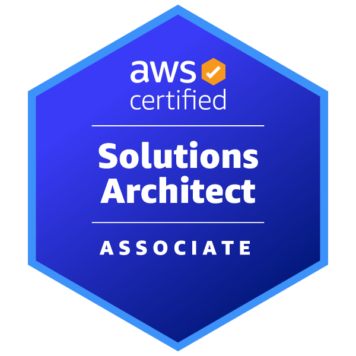
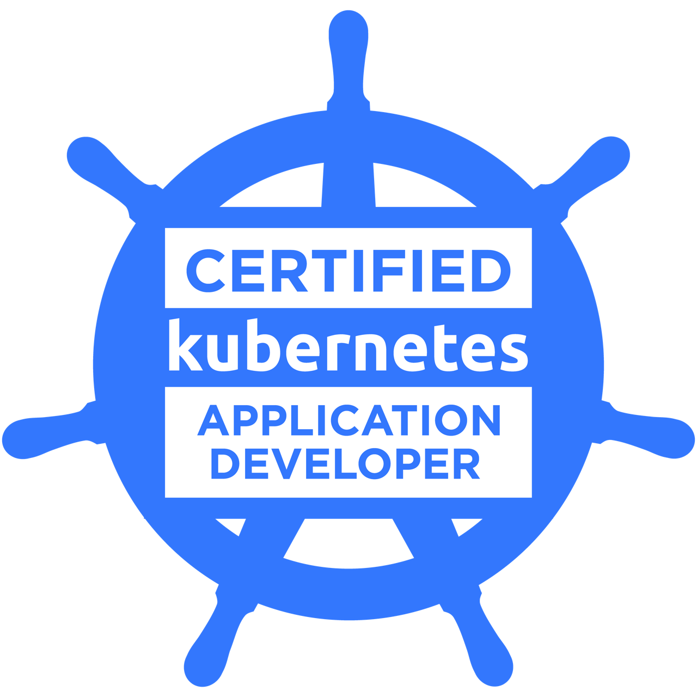

☁️ **On a Cloud-Native Journey**

## 📚 Currently Exploring

- Kubernetes
- Cilium

## ❤️ What I Love

- Nix
- HomeLab setup
- Ricing dots

## 🏅 Certifications

- AWS Solutions Architect Associate (SAA-C03, 2025.09)
- Certified Kubernetes Administrator (2026.04)
- Certified Kubernetes Application Developer (2026.06)
- 리눅스마스터 2급 (2025.03)

## 🎓 Education & Training

- CJ OliveNetworks · Cloud Wave 6기 (2025.06 ~ 2025.08)
- Hallym University (2021.03 ~ 2027.02 예정)

## 🔗 Links

- <a href="https://solved.ac/profile/chaewoon67" target="_blank" rel="noopener noreferrer">Solved.ac</a>
- <a href="https://leetcode.com/u/fudoge/" target="_blank" rel="noopener noreferrer">LeetCode</a>
- <a href="https://blog.chaewoon.work" target="_blank" rel="noopener noreferrer">Blog</a>
