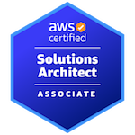

☁️ **On a Cloud-Native Journey**

## 📚 Currently Exploring
- Kubernetes
- Cilium
- Argo Projects

## ❤️ What I Love
- Nix
- HomeLab setup
- Ricing dots
- Catppuccin

## 🏅 Certifications

- AWS Solutions Architect Associate (SAA-C03, 2025.09)
- 리눅스마스터 2급 (2025.03)

## 🎓 Education & Training
- CJ OliveNetworks · Cloud Wave 6기 (2025.06 ~ 2025.08)
- Hallym University (2021.03 ~ 2027.02 예정)

## 🔗 Links
- [Solved.ac](https://solved.ac/profile/chaewoon67)
- [LeetCode](https://leetcode.com/u/fudoge/)
- [Blog](https://riveroverflow.pages.dev)
